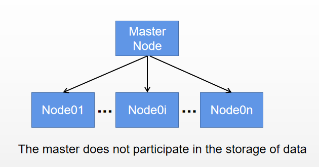

PivotRepair
=====
update:
`root` grant is no longer required, you can run the project in current directory. 
To do so, you must change  `self.user_name` and `self.pdir` in `config_creator.py` accordingly.
Make sure every node can connect to each other in ssh's password-free mode because the python scripts use
`scp` and `ssh` commands.
---
Here is the source code of `PivotRepair` prototype system described in our paper submitted to ICDCS 2022.

Preparation
----

We implement `PivotRepair` on Ubuntu-16.04. So the tutorial as follows is also based on Ubuntu-16.04.

Users can use `apt` to install the required libraries.

 - g++
 - make & cmake
 - nasm
 - libtool & autoconf
 - git

```bash
$  sudo apt install g++ make cmake nasm autoconf libtool git
```

`PivotRepair`  is built on ISA-L ,Sockpp and Wondershaper. Users can install these three libraries manually:

- **Intel®-storage-acceleration-library (ISA-L)**.

  ```bash
  $  git clone https://github.com/intel/isa-l.git
  $  cd isa-l
  $  ./autogen.sh
  $  ./configure; make; sudo make install
  ```

- **Sockpp**

  ```bash
  $  git clone https://github.com/fpagliughi/sockpp.git
  $  cd sockpp
  $  mkdir build ; cd build
  $  cmake ..
  $  make
  $  sudo make install
  $  sudo ldconfig
  ```

- **Wondershaper**

  ```bash
  $  git clone https://github.com/magnific0/wondershaper.git
  $  cd wondershaper
  $  sudo make install
  ```

## Architecture

the architecture of the system is shown as below:


The master node take on the computation and deploy job, while the other nodes function as storage nodes.

## Preparation

### Configuration

- Before running, users should implement all the libraries and tools listed above on all the computers or servers include one master and n nodes.  (To utilize this tool, user should also configure that the `master_node` has connected to all the other nodes by SSH without password. Note that the script is based on the assumption that the other nodes are mapped orderly like node01/node02/... in `/etc/hosts`. Besides, all the nodes need to login by user `grasure`.)

- There are also two configuration files in the project dir that the user needs to modify.

#### ip.txt

This file describes the IP addresses of nodes included. The first line is the IP of MasterNode, and the lines as follows are IP addresses of DataNodes. The order of IP is the same as that of node index. Each IP occupies one line.

#### test_main.py

This file describes the coding scheme info. The keys and the values are separated by '=' in line 6 to line 13. Each key occupies one line.

| Key             | Description                                                  |
| --------------- | ------------------------------------------------------------ |
| nodes_num       | Total nodes numbers exclude the master node.                 |
| each_times      | The times that needs to be test each situation.              |
| algs            | The repair path algorithms that needs to be tested.          |
|   ('r' for RP, 'f' for PivotRepair and 'p' for PPT.)         |
| nks             | The ns and ks that need to be tested.                        |
|   Note that n + k should be smaller than nodes_num.          |
| size            | ChunkSize (bytes).                                           |
| psize           | SliceSize (bytes).                                           |

For example,  scheme content bellow shows a test using PivotRepair and PPT scheme, and its chunk size is 2 ^ 26 bytes and its slice size is 2 ^ 15 bytes. Every scheme will be tested on (12, 8) and (6, 4) environment and each test will run 5 times.

```test_main.py
nodes_num = 12
each_times = 5

algs = ['f', 'p']
nks = [(12, 8), (6, 4)]

size = 2 ** 26
psize = 32768
```

## Run and Shut Down

- To run the **prototype system**, users should run the `run.sh` (at the grasure directory of repository),

  ```bash
  $  cd PivotRepair
  $  ./run.sh
  ```

- To interrupt and stop the **prototype system**, users should run the `down.sh` (at the grasure directory of repository),

  ```bash
  $  cd PivotRepair
  $  ./down.sh
  ```
## Config
The config file is automatically generated by the master node, located at `config/config.txt`. The meaning of each line is interpreted as below:
-   `aconf_addr`: the path of the address config file;
-  `bw_addr`: the path of the bandwidth config file;
-  `wdfile_addr`: the path of the test-task file;;
- `tc_addr tc_port`: the master node's address and port;
- `din_num  prc_num  out_num`: the number of download threads, the number of data processing threads and the number of transfer threads respectively;
- `mem_num  mem_size`: the number of blocks and the blocksize in memory;
- `read_addr`: the path of the original file;
- `write_addr`: the path of the decoded file;
- `suffix`: the suffix of the file, e.g., `.txt`;
- `width  fillc`: setwidth of the output and the filled character of output;
- `max_load_size`: the max load size of a file;
- `min_global_min`: the max global min bandwidth;

## Results

- Results will be stored in directory `source/new_test`

## Future

- The system currently ignores the data availability of disk level, we'll work on that soon.
- The system fails to consider when N > k + m, e.g., the nodes number outnumbers the erasure's N.
- The system stores the meta data and storage data in one location.
- The system lacks a server to handle customer's requests. 
